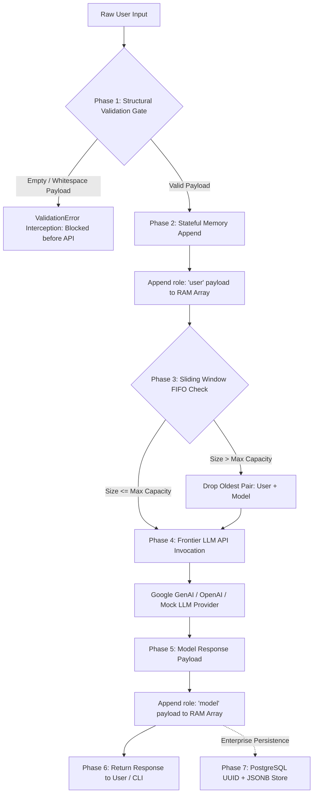

# Project 1: Custom AI Chatbot with Memory

**Senior AI Architect Blueprint & Core Implementation**  
*Decode Lab | Production-Grade Stateful LLM Memory Architecture*

---

## Executive Summary & System Overview

This repository contains the complete core implementation for **Project 1: Custom AI Chatbot with Memory**. Designed as an enterprise-grade, stateful conversational system in Python 3.10+, it integrates with official frontier LLM SDKs (Google GenAI / OpenAI) and implements structural guards, dynamic context sliding windows, automated memory auditing, and PostgreSQL relational database persistence.

---

## Architectural Workflow & Data Pipeline



---

## Core Architectural Components

### 1. Stateful Memory Loop
- **In-Memory History Array**: Stores conversation history in a structured payload format containing role attribution (`user` or `model`/`assistant`) and message text.
- **Context Preservation**: Every new interaction appends the user input and the corresponding LLM response into the active RAM list to preserve multi-turn context.

### 2. Structural Validation Gate
- **Pre-API Interception Guard**: Intercepts user inputs *before* invoking external LLM APIs.
- **Error Prevention**: Rejects `None`, empty strings, and whitespace-only payloads (`"   "`, `"\n\t"`), raising a custom `ValidationError` to prevent wasteful token calls and HTTP `400 Bad Request` API errors.

### 3. Sliding Window FIFO Algorithm
- **Dynamic Context Capping**: Enforces First-In-First-Out (FIFO) dynamic array truncation when history exceeds `MAX_MEMORY_MESSAGES`.
- **Conversational Symmetry**: Drops the oldest User + Model message pair simultaneously to maintain balance and prevent context window overflow or token budget exhaustion.

### 4. System Audit Functionality ("Memory Exam")
- **Automated Diagnostic Suite**: Included in `run_audit.py` to evaluate memory retention through distraction turns.
- **Memory Exam Flow**:
  1. *Fact Injection*: `"My name is Vipin"`
  2. *Context Distraction*: `"Write a long poem about artificial intelligence"`
  3. *State Extraction Test*: `"What is my name?"`
- **Assertion**: Verifies that `"Vipin"` is successfully extracted from active context despite intervening tokens.

### 5. Enterprise PostgreSQL Persistence (Bonus Architecture)
- **Database Schema**: Demonstrates scaling local RAM arrays to distributed databases using `chat_sessions` and `chat_memory_snapshots` tables.
- **UUID & JSONB Storage**: Session indexed by `UUIDv4` primary key (`session_id`) with conversation history stored in an indexed `JSONB` column (`messages`).

---

## Detailed Phase Breakdown

### Phase 1: Foundation Setup (`requirements.txt`, `.env.example`)
- Established workspace environment configurations.
- Integrated `google-genai` and `openai` SDK dependencies with `python-dotenv` and `psycopg2-binary`.

### Phase 2: Core Memory Engine & Structural Validation Gate (`memory_manager.py`)
- Created `ValidationError` exception class.
- Implemented `validate_user_input()` structural interceptor function.
- Built `SlidingWindowMemory` class enforcing FIFO paired array truncation.

### Phase 3: Stateful Chatbot Engine & SDK Binding (`chatbot.py`)
- Developed `StatefulChatbot` class with unified SDK resolution for Google GenAI (`gemini-2.5-flash`), OpenAI (`gpt-4o-mini`), and a zero-dependency `MockLLMProvider`.
- Wrapped interaction pipeline: `Validate` ➔ `Append User` ➔ `LLM Call` ➔ `Append Model` ➔ `Return`.

### Phase 4: Enterprise Database Persistence Module (`db_persistence.py`)
- Created `PostgresMemoryStore` class supporting DDL execution, JSONB serialization, GIN indexing, and UUID session management.
- Implemented simulated DB mode for environments without a live PostgreSQL instance.

### Phase 5: System Audit Suite (`run_audit.py`)
- Built automated test runner verifying Validation Gate, Memory Exam, Sliding Window Truncation, and Database Persistence.
- Configured Windows-safe UTF-8 console output encoding.

### Phase 6: Interactive CLI Application (`main.py`)
- Built interactive terminal session supporting slash commands (`/audit`, `/memory`, `/summary`, `/persist`, `/clear`, `/help`, `/exit`).

### Phase 7: Verification & Testing
- Executed `python run_audit.py` and validated that **all 4 System Audits passed with 100% success**.

---

## File Structure

```
Custom AI Chatbot with Memory/
├── .env.example              # Configuration template for API keys & DB settings
├── requirements.txt          # Python project dependencies
├── memory_manager.py         # Structural Validation Gate & Sliding Window FIFO engine
├── chatbot.py                # Stateful Chatbot engine with LLM SDK bindings
├── db_persistence.py         # Enterprise PostgreSQL persistence module (UUID + JSONB)
├── run_audit.py              # Automated System Audit ("Memory Exam") test runner
├── main.py                   # Interactive CLI application
└── README.md                 # Project architectural documentation & setup guide
```

---

## Setup & Execution Guide

### Prerequisites
- **Python 3.10+** installed on your system.
- *(Optional)* **Google Gemini API Key** (`GEMINI_API_KEY`) or **OpenAI API Key** (`OPENAI_API_KEY`). If omitted, the chatbot automatically operates in robust **Mock Provider Mode**.
- *(Optional)* **PostgreSQL 14+** running locally or remotely for DB persistence testing.

---

### Step 1: Environment Setup

1. **Clone or navigate to the workspace directory**:
   ```bash
   cd "d:\DECODE LAB GENERATIVE AI\Project 1\Custom AI Chatbot with Memory"
   ```

2. **Create and activate a virtual environment**:
   ```bash
   python -m venv venv
   # On Windows PowerShell:
   .\venv\Scripts\Activate.ps1
   # On Linux/macOS:
   source venv/bin/activate
   ```

3. **Install required dependencies**:
   ```bash
   pip install -r requirements.txt
   ```

4. **Configure environment variables**:
   ```bash
   cp .env.example .env
   ```
   *Edit `.env` to supply your API keys if executing against live frontier models.*

---

### Step 2: Running the Automated System Audit ("Memory Exam")

Execute the audit suite to run the structural validation test, Memory Exam, sliding window truncation, and DB persistence verification:

```bash
python run_audit.py
```

**Expected Output:**
```
===========================================================================
  SYSTEM AUDIT FINAL SUMMARY
===========================================================================
  - 1. Structural Validation Gate Interceptor       : [PASSED]
  - 2. System Memory Exam (Retention Test)          : [PASSED]
  - 3. Sliding Window FIFO Dynamic Truncation       : [PASSED]
  - 4. Enterprise PostgreSQL JSONB Persistence      : [PASSED]

===========================================================================
  [SUCCESS] ALL SYSTEM AUDITS PASSED SUCCESSFULLY! ARCHITECTURE IS CERTIFIED.
```

---

### Step 3: Running the Interactive Web UI

Launch the Flask Web Server backend to test the chatbot with a modern, responsive Web UI:

```bash
python app.py
```

Then open your browser and navigate to:
**`http://127.0.0.1:5000`**

#### Web UI Features:
- **Real-Time Memory Dashboard**: Monitors active message capacity (e.g. `2 / 10 Messages`), FIFO dropped message pairs, active turns, and provider status.
- **Structural Validation Alert**: Displays instant warning banner when whitespace or empty inputs are intercepted.
- **Interactive System Audit Modal**: Click **"Run System Audit ('Memory Exam')"** to execute diagnostic tests directly from the browser.
- **PostgreSQL Persistence Button**: Trigger JSONB persistence snapshot with a single click.

---

### Step 4: Running the Interactive Chatbot CLI

Start the terminal CLI session:

```bash
python main.py
```

#### Available CLI Slash Commands
| Command | Action Description |
| :--- | :--- |
| `/help` | Displays interactive command menu |
| `/audit` | Triggers live System Audit suite ("Memory Exam") |
| `/memory` | Displays current in-memory rolling window history array |
| `/summary` | Shows memory manager stats (active count, max cap, total dropped) |
| `/persist` | Saves current RAM array to PostgreSQL JSONB under session UUID |
| `/clear` | Resets in-memory history array |
| `/exit` | Exits the CLI application |

---

## Enterprise PostgreSQL Schema Reference

```sql
-- PostgreSQL Schema DDL (Included in db_persistence.py)
CREATE EXTENSION IF NOT EXISTS "uuid-ossp";

CREATE TABLE IF NOT EXISTS chat_sessions (
    session_id UUID PRIMARY KEY DEFAULT uuid_generate_v4(),
    user_id VARCHAR(255) NOT NULL,
    created_at TIMESTAMP WITH TIME ZONE DEFAULT CURRENT_TIMESTAMP,
    updated_at TIMESTAMP WITH TIME ZONE DEFAULT CURRENT_TIMESTAMP,
    metadata JSONB DEFAULT '{}'::jsonb
);

CREATE TABLE IF NOT EXISTS chat_memory_snapshots (
    snapshot_id UUID PRIMARY KEY DEFAULT uuid_generate_v4(),
    session_id UUID NOT NULL REFERENCES chat_sessions(session_id) ON DELETE CASCADE,
    messages JSONB NOT NULL,
    message_count INTEGER NOT NULL,
    persisted_at TIMESTAMP WITH TIME ZONE DEFAULT CURRENT_TIMESTAMP
);

CREATE INDEX IF NOT EXISTS idx_chat_memory_jsonb ON chat_memory_snapshots USING gin (messages);
```

---

## License & Attribution

Developed by **Senior AI Architect** for **Decode Lab**.  
Built for high-concurrency, scalable LLM state management.
